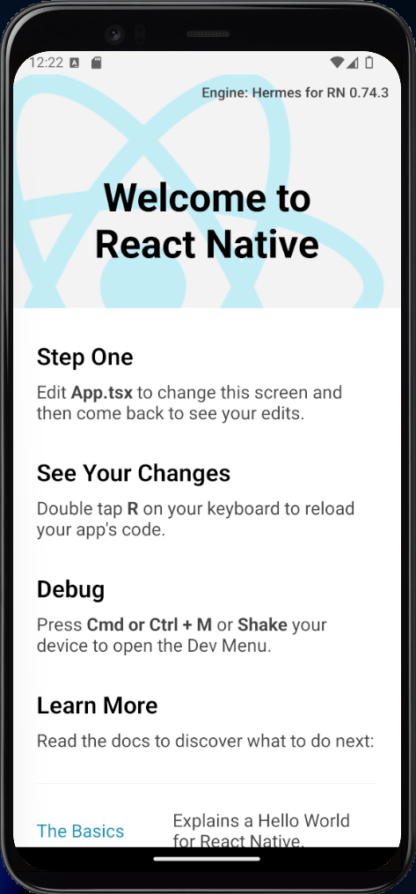
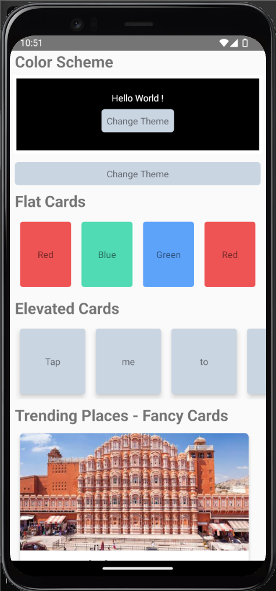
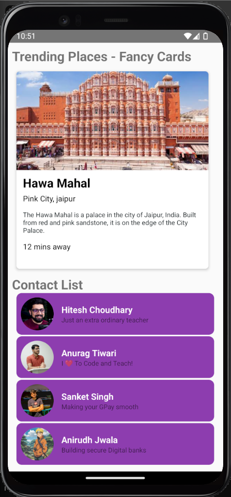

# React Native CLI

## Youtube Playlist
I have learned React native from the following YouTube Resources:  
Hitesh Choudhary - [React Native Mastery with 10 apps](https://www.youtube.com/playlist?list=PLRAV69dS1uWSjBBJ-egNNOd4mdblt1P4c)

## Mini Proejcts using CLI
1. [Proejct 1 - AwsomeProject (New React Native App)](https://github.com/ShauryaChawan/React-Native-Practice-Project/tree/main/P1_AwsomeProject)
2. [Project 2 - Styling](https://github.com/ShauryaChawan/React-Native-Practice-Projects/tree/main/P2_Styling)
3. [Project 3 - PasswordGenerator]()
4. [Project 4 - Background Changer]()
5. [Project 5 - Roll the Dice]()
6. [Project 6 - Currency Converter]()
7. [Project 7 - TicTacToe]()
8. [Project 8 - SpotifyMusic]()
9. [Project 9 - NavigationExplore]()
10. [Project 10 - Shopping]()
11. [Project 11 - AppWrite]()

## 1. [Proejct 1 - AwsomeProject (New React Native App)](https://github.com/ShauryaChawan/React-Native-Practice-Project/tree/main/P1_AwsomeProject)

## 2. [Project 2 - Styling](https://github.com/ShauryaChawan/React-Native-Practice-Projects/tree/main/P2_Styling)

   
   
   
   

## 3. [Project 3 - PasswordGenerator]()
## 4. [Project 4 - Background Changer]()
## 5. [Project 5 - Roll the Dice]()
## 6. [Project 6 - Currency Converter]()
## 7. [Project 7 - TicTacToe]()
## 8. [Project 8 - SpotifyMusic]()
## 9. [Project 9 - NavigationExplore]()
## 10. [Project 10 - Shopping]()
## 11. [Project 11 - AppWrite]()

## Blogs:

1. [React Native] - 
   1. Intro to React Native
   2. React vs React Native
   3. React Native CLI vs Expo
2. Creating new React Native CLI app on Windows
3. Errors for setting up React Native on Windows
4. Files and Folder structure of a React Native app
5. SafeAreaView
6. View
7. Text
8. StyleSheet
9. useColorScheme
10. Scrollview
    1.  ScrollView vs FlatList
11. FlatList
    1.  ScrollView vs FlatList
12. Image
13. Button
    1.  Button vs TouchableOpacity
14. TouchableOpacity
    1.  Button vs TouchableOpacity
15. Pressable